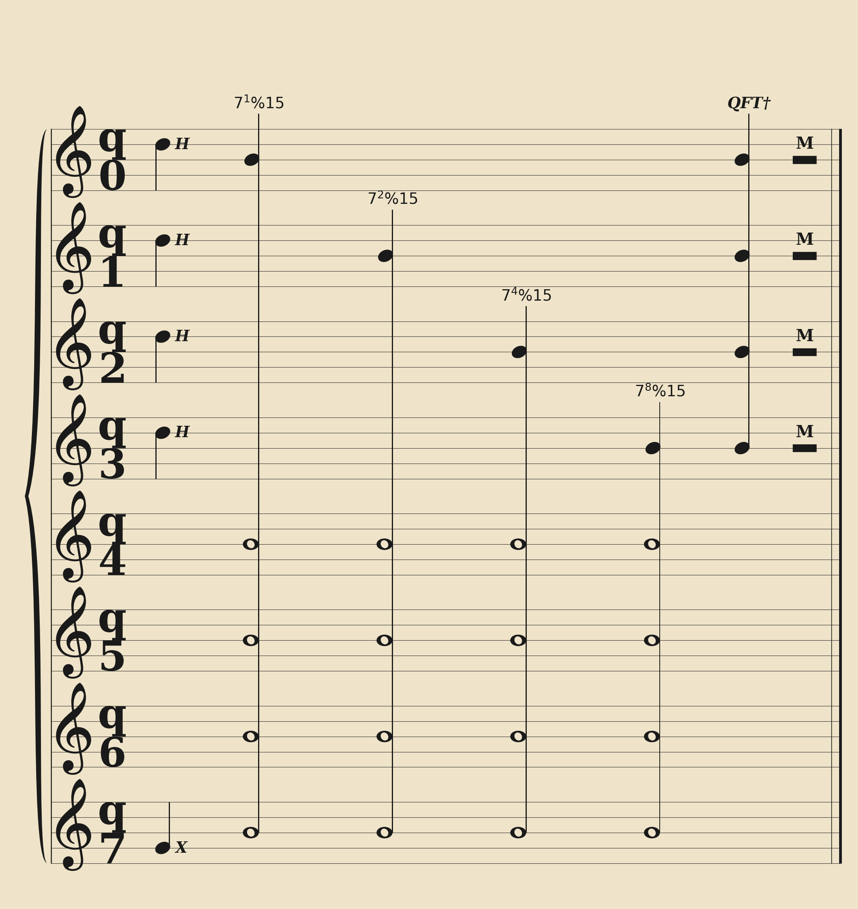

# QuantumSheets

QuantumSheets is a Python library that renders Qiskit quantum circuits as classical sheet music. It maps quantum gates to musical notes on a staff, providing an alternative visual representation for quantum algorithms.

## Features

- **Native Qiskit Support**: Accepts standard `qiskit.QuantumCircuit` objects.
- **Musical Notation**: Renders single-qubit gates as notes and multi-qubit gates as chords with proper stems and clefs.
- **Audio Synthesis**: Generates `.wav` files playing the circuit's sequence. Pitches are mapped to gates, and multi-qubit gates generate polyphonic chords.
- **MathText Rendering**: Supports LaTeX/MathText in gate labels (e.g., `$7^{1} \\% 15$`).
- **Dynamic Layout**: Automatically wraps long circuits across multiple systems and adjusts horizontal spacing for long labels.

## Example: Shor's Algorithm

An 8-qubit implementation of Shor's Algorithm:



## Quickstart

```python
from qiskit import QuantumCircuit
from QuantumSheets import draw_circuit

qc = QuantumCircuit(3)
qc.h(0)
qc.cx(0, 1)
qc.cx(1, 2)
qc.measure_all()

# Render circuit to image
draw_circuit(qc, filename="circuit.png", strip=True)
```

### CLI Usage

You can generate images and audio directly from the command line:

```bash
python -m QuantumSheets.cli my_circuit.py -o output.png --audio
```

## License
MIT License
